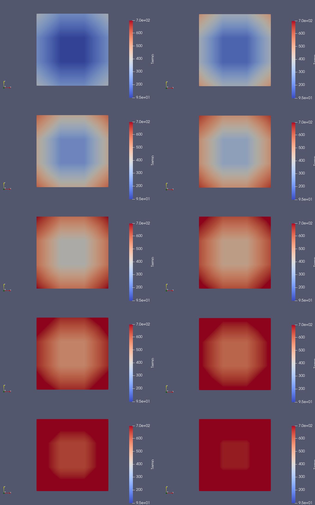

## FEM

This program is an academic project created for credit in the Finite Element Method course.
It operates on a two-dimensional analysis area divided into quadrangular finite elements and performs interpolation using the method of Gaussian quadrature for a 2-, 3- or 4-point formula.

## Model

In order to load data correctly, the model parameters must be preceded by the appropriate identifiers:

- "SimulationTime" – simulation duration,
- "SimulationStepTime" – simulation time step,
- "Conductivity" – thermal conductivity,
- "Alpha" – heat transfer coefficient,
- "Tot" – ambient temperature,
- "InitialTemp" – initial temperature,
- "Density" – density,
- "SpecificHeat" – specific heat,
- "Nodes number" – number of nodes,
- "Elements number" – number of elements,
- "*Node" – node coordinates, preceded by an index
- "*Element" – numbers of nodes constituting an element, preceded by an index
- "*BC" – indexes of nodes for which the boundary condition applies

The example model can be found in the file `example.txt`.

## Requirements

- Java 5 or greater

## Compile and Run

You can easily run the program by opening the project in IntelliJ IDEA and using the built-in run option in `Main.java` file.

Alternatively, you can compile and run the project using the following commands in terminal:

  ```
javac -encoding UTF-8 -d out src/*.java
java -cp out Main
  ```

Make sure you are in the directory `FEM` before executing the commands.

## Other
An example of using data from the program to simulate the unsteady heat transport process with the convection boundary condition in ParaView.
